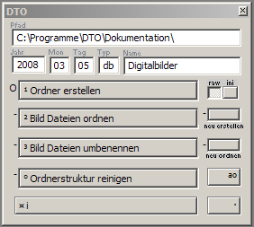

# DTO
The file organizing tool (DTO) is a 32-bit Windows application for the systematic archiving and renaming of image files (mainly JPG) in the course of image organization.

 The generated folder structure contains a main folder (1) and one or, in the case of processed raw files, two subfolders (2) and (3) with the ordered and renamed image files or raw files.

## Screenshots

## Manual
https://www.academia.edu/81738669
